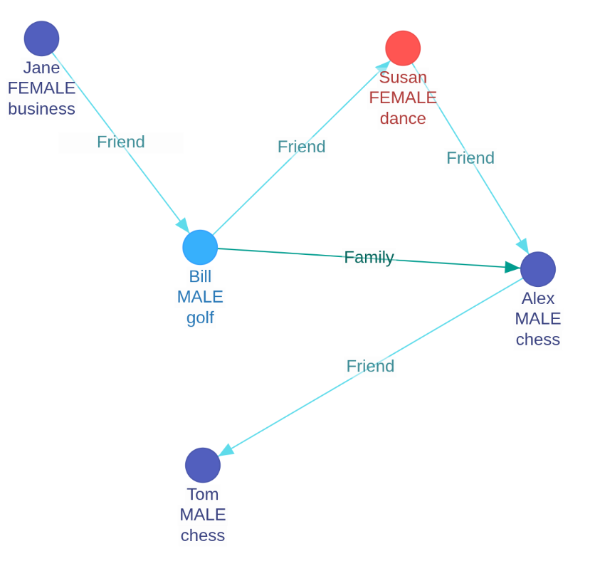

# **Kinetica Graph: Schema & Naming Best Practices**

To streamline graph creation in Kinetica, you can leverage **pre-defined grammar aliases** for your column names. Using these specific names allows the engine to automatically map your data, removing the need for explicit AS directives or manual annotations.


<h1>Kinetica Wikipedia Example Graph</h1>  

**🧩 Core Concepts**

Graphs in Kinetica are built from two primary components: **Nodes** and **Edges**.

* **Grammar Verification**: To view the full list of valid identifier combinations for your version, call the /show/graph/grammar endpoint.  
* **Polymorphic Labels**: The alias LABEL is context-aware. In a Node section, it maps to NODE\_LABEL; in an Edge section, it maps to EDGE\_LABEL.

## ---

**🏗️ Component Naming Conventions**

By using the generic aliases below, the /create/graph endpoint will automatically ingest your tables without extra configuration.

### **Node Tables**

| Generic Alias | Technical Identifier | Description |
| :---- | :---- | :---- |
| **NODE** | NODE\_ID / NODE\_NAME | The primary identifier (Integer or String). |
| **LABEL** | NODE\_LABEL | Categorical string used to classify the node. |

**Note:** Additional columns (e.g., age, revenue) are ignored during the graph build but remain available for **OLAP joins** during Cypher queries.

### **Edge Tables**

| Generic Alias | Technical Identifier | Description |
| :---- | :---- | :---- |
| **NODE1** | EDGE\_NODE1\_NAME | The source node of the relationship. |
| **NODE2** | EDGE\_NODE2\_NAME | The target node of the relationship. |
| **LABEL** | EDGE\_LABEL | The type of relationship (e.g., 'FRIEND\_OF'). |

## ---

**💻 Implementation Example: wikipedia example for persons and their hobbies**

### **1\. Define Your Tables**

Create tables using the standard grammar to bypass manual mapping.

```SQL

-- Create the nodes table schema
CREATE OR REPLACE TABLE wiki_graph_nodes (    
    node  CHAR(64) NOT NULL,
    label VARCHAR[] NOT NULL,
    -- Non-graph columns    
    age   INT
);

CREATE OR REPLACE TABLE wiki\_graph\_edges (      
    node1  CHAR(64) NOT NULL,  
    node2  CHAR(64) NOT NULL,  
    label  VARCHAR[] NOT NULL,
    -- Non-graph column  
    met_time DATE   
);
```
## 3. Reference Notes

* **Grammar Verification**: To view the full list of valid identifier combinations, call the `/show/graph/grammar` endpoint. This returns a JSON object listing identifiers and combinations (e.g., the `NODE` and `LABEL` two-tuple) per component.
* **Auto-Annotation**: By using the names `node`, `node1`, `node2`, and `label`, you bypass the need for `AS` directives in your graph endpoints.

## 4. Create Graph

This step involves defining the directed graph using the `input_tables` macro. Because the underlying tables follow the recommended naming conventions (the "Graph Grammar"), the syntax remains clean and concise. 

### Ontology & Label Grouping

To keep the graph schema (ontology) concise, you can group labels under "Label Keys." For example, "MALE" and "FEMALE" can be grouped under a "Gender" super-set.

* **Label Keys**: Using `LABEL_KEY` allows the system to collapse the ontology visualization based on these categories.
* **Default Behavior**: The option to use label keys for ontology generation is enabled by default (`true`).

```SQL
-- Create or Replace a directed graph with label groupings and debugging table

CREATE OR REPLACE DIRECTED GRAPH wiki_graph (
    nodes => input_tables(
        -- Optional label groupings for concise ontology generation
        (SELECT 'Gender' AS LABEL_KEY, string_to_array('MALE,FEMALE',',') AS LABEL),
        (SELECT 'Interest' AS LABEL_KEY, string_to_array('golf,business,dance,chess',',') AS LABEL),

        -- Primary node data
        (SELECT * FROM wiki_graph_nodes)
    ),
    edges => input_tables(
        -- Optional label groupings for relations
        (SELECT 'Relations' AS LABEL_KEY, string_to_array('Family,Friend',',') AS LABEL),

        -- Primary edge data
        (SELECT * FROM wiki_graph_edges)
    ),
    options => kv_pairs(graph_table = 'wiki_graph_table')
);

```
* **Simplified Selection**: Since the table columns match the expected grammar (e.g., `node`, `label`), you can use a simple `SELECT *` or even just the table name.
* **Explicit Annotation**: If your table used non-standard names (e.g., `Person` instead of `node`), you would be required to use the `AS` keyword to map them:
`nodes => input_tables((SELECT Person AS node, hobby AS label FROM wiki_graph_nodes))`


**⚠️ Visualization & Debugging**

* **graph\_table**: This option creates relational tables (e.g., wiki\_graph\_table\_nodes) that mirror the in-memory graph.  
* **Performance Warning**: Avoid using graph\_table for graphs larger than **1,000 elements**, as the overhead for table generation is high.  
* **Workbench UI**: These tables power the generic graph UI using the **Orb library**, allowing for visual inspection and force-directed layouts.

---

**Would you like me to generate a sample JSON request body for the /create/graph REST endpoint using these same conventions?**
