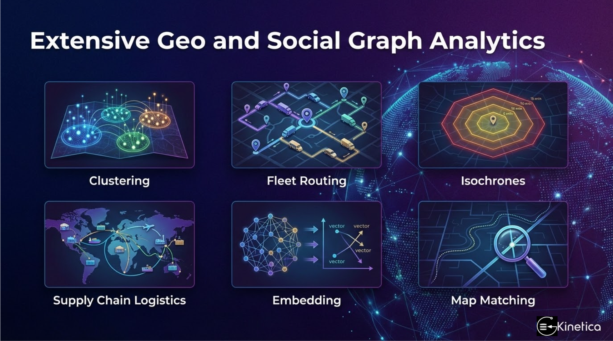

<h1>Kinetica Graph </h1>
Kinetica Graph is a distributed, hybrid graph database engineered to work in tandem with the Kinetica relational engine. By bridging the gap between property graphs and OLAP expression support, it allows for high-performance analytics within a unified ecosystem.

* [Core Technical Advantages](#core-technical-advantages)
* [User Guide on Wikipedia Example](./quickguide,md)

## Core Technical Advantages

* **Predictable Memory Management:** Unlike databases that struggle with unstructured vertex valences, Kinetica uses fixed, calculable storage. The memory footprint is roughly twice the size of a bare-minimum CSR format, following the formula: .
* **True Dynamic Topology:** Utilizing an **inplace double links** data structure, Kinetica supports constant-time insertions and deletions. This eliminates the need to recreate the entire graph structure during modifications—a major limitation of CSR-based competitors like Neo4j and TigerGraph.
* **Unified SQL & OLAP Integration:** Every endpoint supports OLAP expressions, allowing graph outputs to function as table functions. This enables complex analytics, including joins and "group by" operations, to be executed within a single, concise SQL statement.
* **Efficient Sharding & Distribution:** The graph topology is distributed across multiple servers and nodes. To maximize efficiency, only nodes at inter-graph boundaries are duplicated; partitioned graphs remain independent while graph solvers iterate seamlessly across the cluster.
* **Cypher & GQL Compliance:** The system supports multi-hop, many-to-many property graph queries using Cypher. The query planner is highly optimized to bridge relational and graph data access seamlessly.

### Scalable Analytics & Solvers

Kinetica exposes a wide array of advanced graph algorithms through a few streamlined RESTful endpoints, supporting both classical graph theory and modern machine learning:

* **Supply Chain & Geo-Graph Analytics:** Best-in-class support for logistics, including isochrone coverages and Mixed Integer Programming (MIP) for complex optimizations.
* **Advanced Graph Solvers:** Includes Markov chain map matching, Louvain clustering, connected components, and Jaccard similarities for recommendation engines.
* **Security & Pattern Detection:** Eulerian loops for fraud detection, pattern matching, and spectral bisection clustering.
* **Data Science Integration:** Support for novel graph embeddings to facilitate downstream machine learning tasks.

### Visualization & Schema Management

* **Distributed Rendering:** Built-in support for rendering large-scale geo-graphs and generic visualizations within a Jupyter-style workbench.
* **Rich UI Interaction:** Automated visualization tools utilize UI widgets to filter and explore data based on labels, hops, and paths.
* **Automatic Ontology Generation:** A unique feature that generates ontology schemas directly from CRUD statements. This allows billion-node graphs to be visualized in a simplified "dot" format with a schema graph of a much smaller labeled entity connections, making massive datasets instantly interpretable.

