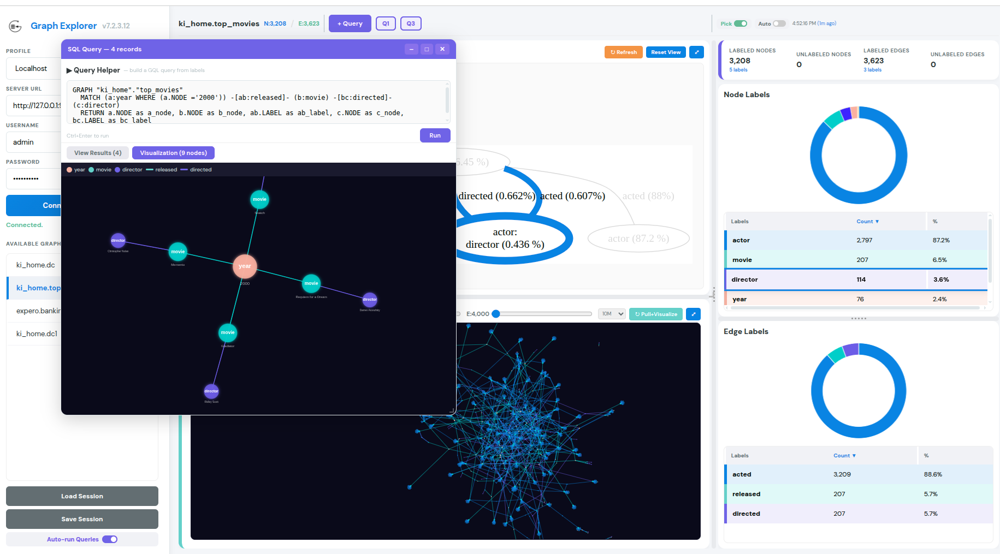
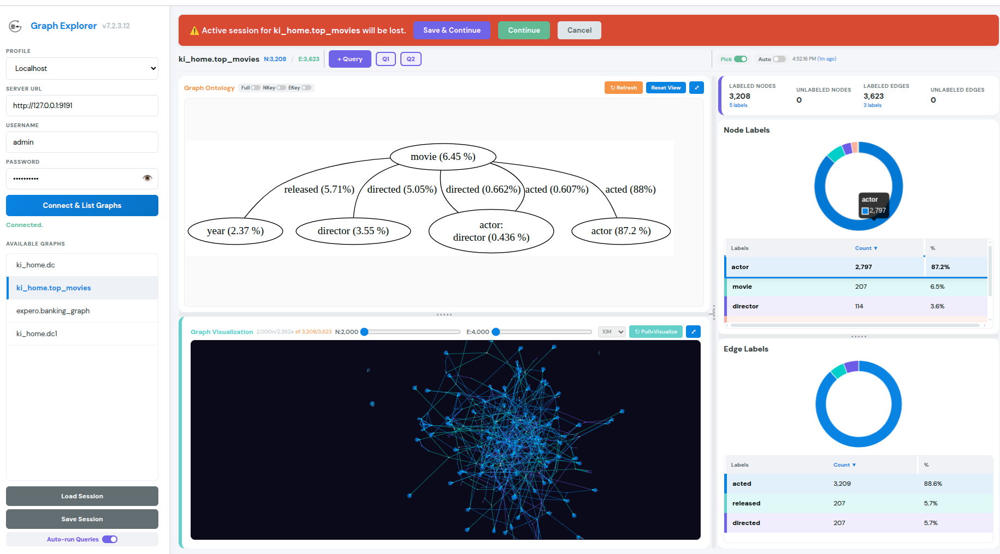
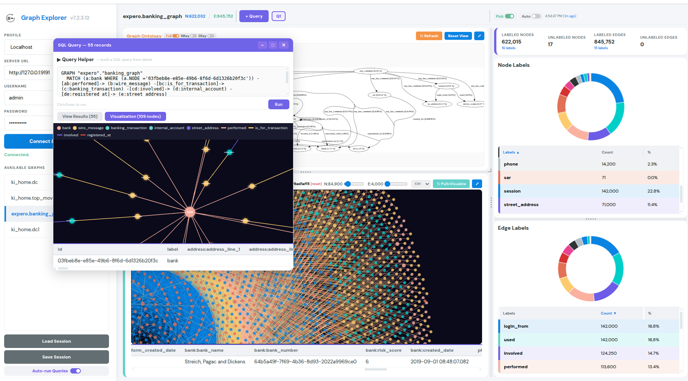
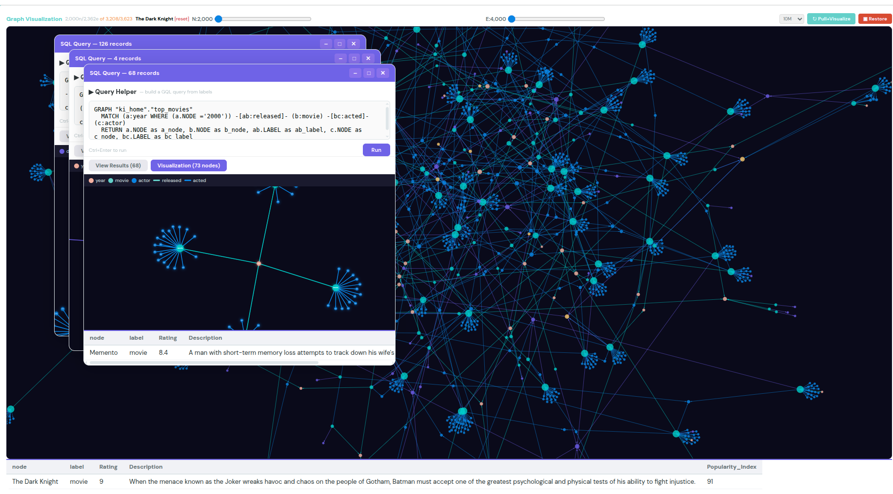
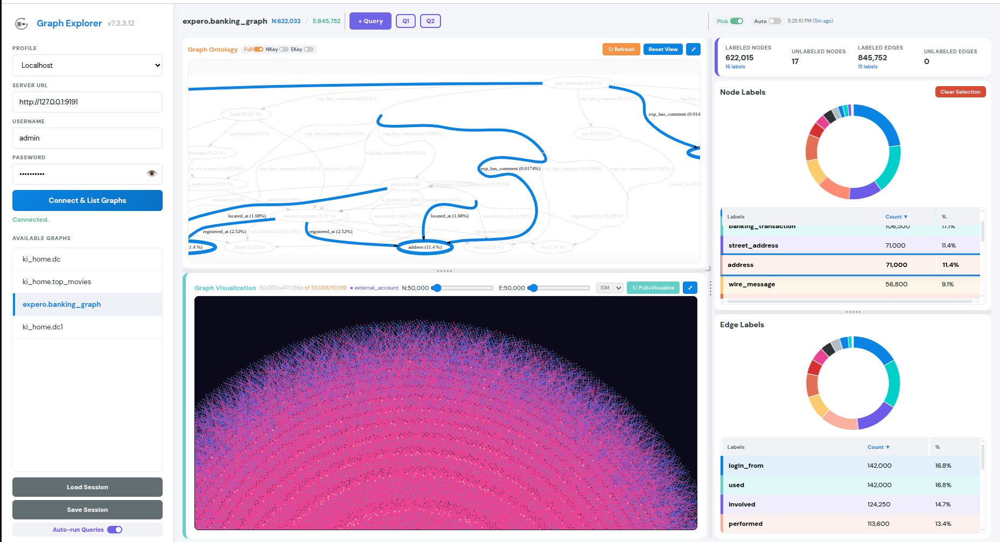
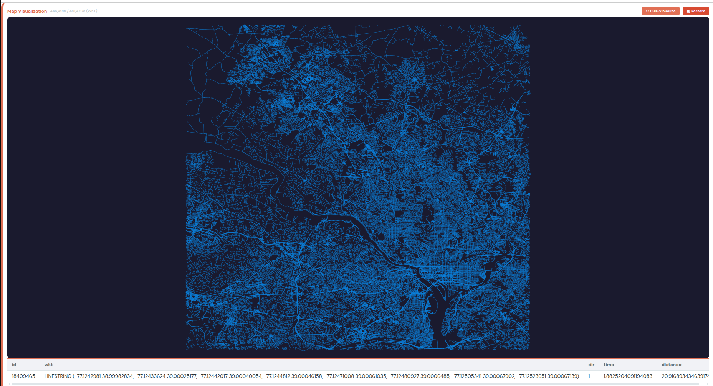
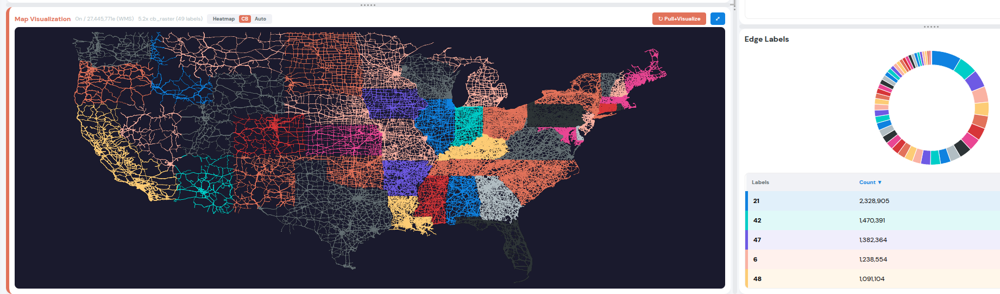
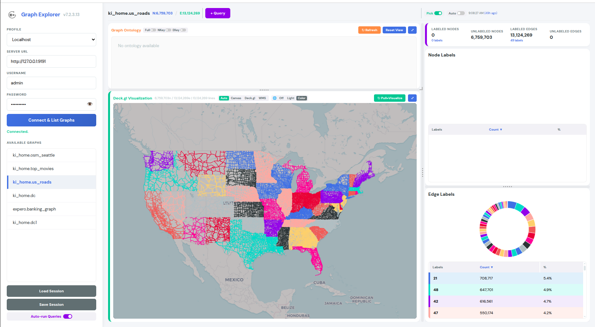

# Kinetica Graph Explorer

A zero-install, browser-based tool for exploring graph data structures in a [Kinetica](https://www.kinetica.com/) GPU database. Connect to any Kinetica instance, browse graphs, inspect label distributions, visualize ontology structures, run GQL queries, and explore query results as interactive path visualizations — all from a single HTML file.

## Quick Start

1. Open `KineticaGraphExplorer.html` in any modern browser.
2. Enter your Kinetica server URL, username, and password in the sidebar.
3. Click **Connect** — available graphs (and tables) appear in the sidebar list.
4. Select a graph to explore, or switch the sidebar to **Tables** to browse base tables.
5. From the dashboard header, use **+ Create** to scaffold a new graph, **+ Query** for SQL/GQL, **+ Solve** / **+ Match** for grammar-driven solver helpers.

No build step, no dependencies to install, no server to run.

### Optional: serve from a web server to enable the 📖 Docs link

The sidebar's `📖 Docs` button opens `../document/Kinetica_Graph_User_Guide.html` (relative to the explorer) in a new tab. When the explorer is opened directly via `file://`, the button is shown optimistically — clicking works as long as the doc is present, but the button can't auto-detect a missing file (Chrome blocks the cross-origin HEAD probe between local files).

To get the auto-detect behavior (and proper image rendering inside the doc), serve the parent `graph/` directory from any static web server. The expected layout is:

```
graph/
  explorer/
    KineticaGraphExplorer.html
  document/
    Kinetica_Graph_User_Guide.html
    <subdirectories with images, css, etc.>
```

Examples that all work the same way:

```bash
# Local dev — one-liner from graph/
python3 -m http.server 8080
# Then open http://localhost:8080/explorer/KineticaGraphExplorer.html
```

Static hosting (nginx, S3, GitHub Pages, etc.) works identically as long as the directory layout above is preserved.

## Screenshots


*Query Helper generates GQL from ontology labels. Multiple query panels with path visualization, force-graph canvas, and node detail lookup.*


*Session loss protection banner when switching graphs — Save & Continue, Continue, or Cancel. Ontology and canvas visualization with label charts.*


*Banking graph: ontology structure, colorful canvas visualization with label filtering, node detail strip from source table, and multi-label doughnut charts.*


*Maximized canvas view: GQL query path visualization with Query Helper, node detail lookup from original source table.*


*Full dashboard: banking graph with 622K nodes / 845K edges — ontology, canvas visualization (50K node/edge limits), label distribution charts with 16 node labels and 15 edge labels.*


*MapView for WKT geospatial graphs: DC road network rendered as canvas lines with zoom/pan, edge picking from original source table, HiDPI rendering.*


*WMS server-side rendering: 27M US road edges colored by state code using class-break raster. Heatmap/CB/Auto style toggle. Edge label distribution chart with 49 state labels.*


*Deck.gl WebGL renderer (v7.2.3.13) on `ki_home.us_roads`: 6.76M nodes / 13.12M edges colored by state across 49 distinct edge labels. The new `🌐 Off | Light | Color` basemap toggle is active with **Color** (CartoDB Voyager) layered under the GPU-rasterized lines for geographic context.*

## Features

### Browsing Graphs and Tables
- **Sidebar tab toggle** — switch the connected-server list between **Graphs** (default) and **Tables**. Tables come from `INFORMATION_SCHEMA.TABLES` (system schemas filtered out).
- **Collapsible sidebar** — a small chevron handle (`‹` / `›`) sits half-attached to the sidebar's right border, IDE-style. Click it to collapse the whole left panel into a 28-px rail (just a vertical "Graph Explorer" label) so the workspace gets the full window width; click `›` on the rail to bring it back.
- **Search filter** — instant client-side filter for the current list. The list title row is omitted to maximize vertical room.
- **Edge-count badge** — each graph row carries a small green badge with the compact edge count (`491k`, `13.1M`). Hover for the full nodes+edges tooltip. Sourced from `/show/graph`'s aligned `num_nodes`/`num_edges` arrays — no extra round trips.
- **Sort toggle** — a tiny `A↓Z` ↔ `#↓` button next to the filter flips the Graphs list between alphabetical (default) and edges-desc.
- **Right-click context menu** — kind-aware actions on any list row:
  - On a **graph**: `Open` (select & load), `Show Create Statement` (modal), `Modify` (opens a Create-Helper panel pre-filled by parsing the graph's CREATE SQL), `Delete…` (red, confirmation modal then `/drop/graph`), `Copy name`
  - On a **table**: `Open Preview rows` (opens a Query panel with `SELECT * FROM <t> LIMIT 100`), `Schema DESCRIBE`, `Copy name`
  - Click-away or `Esc` dismisses the menu. The menu is viewport-clamped so it never falls off-screen.
- **Show Create Statement modal** — calls `/show/graph`, parses `original_request[0]` as JSON, and renders the `CREATE [DIRECTED] GRAPH ...` SQL with the `FROM <table>` names inside `NODES => INPUT_TABLES(...)` and `EDGES => INPUT_TABLES(...)` bolded for quick reference.
- **Action buttons live in the dashboard header** (`+ Create` green, `+ Query` purple, `+ Solve` pink, `+ Match` orange) — not in the sidebar. The sidebar only lists graphs/tables and offers the context menu actions.

### New-Graph Create Helper
Click **`+ Create`** in the dashboard header to open a floating panel titled **Create GRAPH** (a specialized mode of the Query panel). Instead of free-form SQL, you get a structured form that scaffolds a valid `CREATE OR REPLACE [DIRECTED|UNDIRECTED] GRAPH ...` statement.

- **Graph name** + **Action** toggle (`Recreate | Modify`) + **Directed / Undirected** toggle (shown only in Recreate mode — alter cannot change graph directionality).
  - **Recreate** (default for `+ Create`) generates `CREATE OR REPLACE [DIRECTED|UNDIRECTED] GRAPH <name> ( … )`.
  - **Modify** (default when the panel is opened via the graph context menu `Modify`) generates `ALTER GRAPH <name> MODIFY ( … )` with the same body shape — just the leading clause and the `Directed/Undirected` row differ.
- **Per-component sections** — `NODES`, `EDGES`, `WEIGHTS`, `RESTRICTIONS`, plus an **OPTIONS** section for `OPTIONS => KV_PAIRS(key = 'value', …)` entries. Each row in a component section binds one input column to one Kinetica graph identifier.
- **Collapsible `NODES` / `WEIGHTS` / `RESTRICTIONS` sections** — only `EDGES` is mandatory and always expanded; the other three collapse to a single-line pull-down header when empty. Click the header to expand. They auto-expand when they already contain rows (e.g., on Modify).
- **Combo grouping** — each configuration pick (e.g., `NODE1 + NODE2 (string)` in EDGES) spawns a block of rows tagged as a single combo. A header above the block shows the combo label and a `🗑 combo` button that removes all of its rows (required + optional add-ons) in one click. Per-row trash icons still work if you want to drop just one row.
- **Default table per section** — each section has an optional `Default table` input at the top. When set, the row inputs accept bare column names and are auto-joined to the default in the generated SQL (`(SELECT col AS NODE_ID, … FROM <default_table>)`). Mix-and-match: a row whose value contains a dot is treated as a full `schema.table.column` override and goes into its own sub-select (split-table sections still work). Modify auto-folds single-table sections into the default and shows compact column names instead of repeated full paths.
- **Grammar-driven dropdowns** — identifier choices come from `/show/graph/grammar` when available, with a built-in fallback covering the common configurations (e.g., `NODE_ID + NODE_LABEL`, `NODE_NAME`, `NODE_WKTPOINT`) plus optional add-ons (`NODE_LABEL`, weights/restrictions extras, etc.).
- **Table column auto-complete** — type or pick a `schema.table`, and the column input switches to a `<datalist>` populated from a one-shot `/get/records limit:1` probe. Results are cached per table so the same table isn't re-probed.
- **Generic AS naming** — generated SQL uses Kinetica's generic identifier aliases when they fit (e.g., `NODE_NAME` → `AS NODE`, `EDGE_NODE1_WKTPOINT` → `AS NODE1`), and strips the section prefix from the rest (`NODE_LABEL` → `AS LABEL`, `EDGE_ID` → `AS ID`). The generated SQL stays terse and matches what `gadmin` produces.
- **Multiple input tables per component** — rows targeting different tables are grouped automatically into separate `INPUT_TABLES(...)` blocks per component.
- **Run** executes the generated SQL via `/execute/sql`. On success a green banner shows **`✓ Graph <name> created/modified. The sidebar list has been refreshed. Open`** — the sidebar re-fetches `/show/graph` and the **Open** button minimizes the panel (you'll find it as a `C*` pill in the header — your form state is preserved) and selects the new graph into the dashboard.
- **Modify** (graph context menu) reopens this same panel pre-filled by parsing the graph's existing `CREATE GRAPH` statement (NODES/EDGES/WEIGHTS/RESTRICTIONS rows + OPTIONS key/value entries + directed flag + graph name) with the Action toggle pre-set to **Modify** — so the generated SQL is `ALTER GRAPH <name> MODIFY (…)`. Switch the Action toggle to `Recreate` to instead emit a `CREATE OR REPLACE` against the same form.
- **Delete** (graph context menu, red) drops the graph from the server after a small confirmation dialog and refreshes the sidebar.
- **Session save/restore** classifies Create panels separately (`kind: 'create'`) so an iterating Create panel can be saved with its form state; on restore it is **not** auto-run.

### Graph Overview
- **Label Distribution** — Interactive doughnut charts and sortable tables for node and edge labels, with counts and percentages. Click column headers to sort by label name (alphabetical) or count (default).
- **Summary Cards** — At-a-glance counts of labeled/unlabeled nodes and edges, with number of distinct labels shown.

### Ontology Visualization
- Ontology auto-loads on graph selection — renders the graph's structural schema as a Graphviz DOT diagram.
- **Full / NKey / EKey** toggles in the ontology panel header — Full enables exhaustive edge search for accurate percentages; NKey/EKey control schema label grouping. Toggles auto-reload the ontology.
- Pan, zoom, and click on nodes/edges in the ontology to highlight matching labels in the charts.
- **`⤢` Maximize** button for full-viewport ontology view (Esc or `▣ Restore` to return).

### Graph Visualization
- **`↻ Pull+Visualize`** fetches graph nodes and edges via `/get/graph/entities` (with batching for large graphs >500K edges, fallback to `/get/records`). Renderer-toggle clicks (Auto/Canvas/Deck.gl) only switch the rendering mode — they don't auto-fetch. Press Pull+Visualize whenever you want fresh data. Switching between Canvas ↔ Deck.gl reuses already-fetched data.
- **CanvasGraph** (non-WKT graphs) — Force-directed visualization with colors matching label charts. Click a node to fetch its full record from the source table. Node/edge limit sliders and viz limit dropdown in the header.
- **Viz-limit guard** — the limit dropdown (10K / 100K / 1M / 10M / 100M / ∞) gates Pull+Visualize across **all** renderers (Canvas, Deck.gl, MapView). When the graph exceeds the chosen limit, a red confirmation banner with `[Continue]` `[Cancel]` appears. Pick `∞` to disable the warning.
- **Geo graph renderers** — Renderer toggle (`Auto | Canvas | Deck.gl | WMS`) available for WKT graphs:
  - **Deck.gl** (default, `DeckMapView`) — WebGL GPU-accelerated rendering via deck.gl `LineLayer` + MapLibre GL basemap. Handles 27M+ edges at 60fps. Binary Float32Array attributes uploaded directly to GPU. Edge picking on click shows source table record + lon/lat coordinates. Label filtering supported. WebGL antialiasing enabled. `⤢` maximize supported. **`🌐 Off | Light | Color`** segmented control toggles the CartoDB street-map basemap underneath the edges (Light = grayscale `light_all`; Color = `rastertiles/voyager`).
  - **Canvas** (`MapView`) — Legacy Canvas 2D renderer. Pre-parsed WKT→Float32Array, color-batched, rAF-throttled, adaptive LOD, progressive rendering. Good for <2M edges.
  - **WMS** — Kinetica `/wms` server-side tile rendering. No entity fetch needed. Style sub-toggle: `Auto | Heat | Raster | CB`. Heatmap uses the jet colormap with a zoom-aware blur radius so the color spectrum stays consistent as you zoom in. CB shows class-break coloring by edge label (top 20 labels). Zoom (cursor-centered wheel) + pan. Label filtering via `LABEL_FILTER`. **Edge picking**: click on the tile to run a server-side `STXY_DWITHIN` query around the cursor — picked record lands in the detail strip with the full source-table row.
- **Edge-pick architecture**: each renderer uses the natural lookup for its data model. **Deck.gl** and **Canvas** look up the picked edge by ID against the source table (with id-column auto-probe) — the edge data is already client-side, so the only DB hit is one row. **WMS** has no client edge data (image-only), so it uses a server-side `ST_DWITHIN` geographic query around the click point. All three converge on the same detail strip with the full source-table record (weights, labels, etc.) and a pinned highlight on the picked edge.
- **Edge-pick mode toggle** (`Pick: Graph | Table`) in the Canvas and Deck.gl renderer headers: `Graph` (default) is the id-based lookup described above; `Table` is the same `ST_DWITHIN` geographic query that WMS uses, but applied to Canvas/Deck.gl. Both return the same full source-table row when successful — the toggle is mostly there for parity with WMS and for graphs where id-based lookup misses (rare, e.g., custom join tables). WMS always uses geographic.
- **Modal confirmation banners**: when switching servers/graphs with an active session, or when triggering Pull+Visualize beyond the viz limit, the rest of the UI is dimmed behind a translucent overlay and clicks are blocked until you respond to the banner (Save & Continue / Continue / Cancel).
- **📖 Docs button** in the sidebar header opens the Kinetica Graph User Guide in a new tab. Auto-hides under HTTP if the doc file is missing (HEAD probe). Under `file://` (double-clicking the HTML), Chrome blocks the probe so the button shows by default — clicking still works as long as `../document/Kinetica_Graph_User_Guide.html` exists alongside.
- Click a node in the visualization to **copy its entity ID** to clipboard (for use in Query Helper or queries).
- Label selection in the charts filters the visualization to matching subgraphs. Multi-label combos (e.g., `["director","actor"]`) are selected as exact combos — won't match single-label nodes.
- **`⤢` Maximize** button for full-viewport view (Esc or `▣ Restore` to return).
- Supports both directed (`digraph`) and undirected (`graph`) ontology topologies — pathfinding works in both, and generated GQL uses `-[]-` (no arrows) for undirected graphs.

### Solve Graph Helper
- Click **`+ Solve`** in the dashboard header (pink button next to `+ Query`) to open a grammar-driven helper for the `/solve/graph` endpoint.
- Pick a **Solver type** (`SHORTEST_PATH`, `PAGE_RANK`, `STATS_ALL`, …) — drives configuration and option filtering throughout the panel.
- Optional **Solution table** for the result.
- Per-component sections (`WEIGHTS`, `RESTRICTIONS`, `SOURCE_NODES`, `DESTINATION_NODES`) with the same UX as the Create Helper: configuration dropdowns, default-table input, combo grouping, collapsible headers, column auto-complete. For SOURCE_NODES / DESTINATION_NODES the row alias is the generic `NODE` (Kinetica infers ID/NAME/WKTPOINT from the column data). XY-pair configurations (`NODE_X` + `NODE_Y`) are hidden.
- **Constants mode** (`SOURCE_NODES` / `DESTINATION_NODES` and Match `SAMPLE_POINTS`): per-section `Table | Constants` toggle in the section header. Constants mode lets you type literal SQL expressions per row. **N-tuple combos** — pick a multi-identifier configuration (e.g., `SAMPLE_ID + SAMPLE_WKTPOINT` or `NODE_ID + NODE_WKTPOINT`) and the rows it spawns get bundled into one sub-select: `SAMPLE_POINTS => INPUT_TABLES((SELECT 1 AS ID, ST_GEOMFROMTEXT('POINT(-122 37)') AS WKTPOINT))`. Quick **+ Add single literal** button stays for ad-hoc one-off rows (each becomes its own sub-select). Placeholders adapt per alias (WKT aliases hint `ST_GEOMFROMTEXT(...)`, ID aliases hint integers, etc.).
- **OPTIONS** section with key/value rows; the key datalist is filtered to options applicable to the selected solver (e.g., `convergence_limit` only appears under `PAGE_RANK`).
- **Generate** emits `EXECUTE FUNCTION SOLVE_GRAPH(GRAPH => '<active>', SOLVER_TYPE => '<x>', <COMP> => INPUT_TABLES(...), …, OPTIONS => KV_PAIRS(...))`; **Run** executes via `/execute/sql`.
- **Auto-drop** checkbox (default on) next to the Solution table input — when set, the generated SQL is prefixed with `DROP TABLE IF EXISTS <solution_table>;` so consecutive Runs don't trip on a table left behind by the prior call.
- **Multi-statement Run**: the DROP and EXECUTE FUNCTION are sent as two statements; the panel splits on `;` (after stripping `--` and `/* */` comments) and runs them sequentially. First error aborts.
- **Solution rows shown automatically**: after a successful solve with `SOLUTION_TABLE`, the panel auto-runs `SELECT * FROM <solution_table> LIMIT 10000` and shows the result in the **View Results** tab — same flow as a GQL query's results.
- **Path visualization** (force-graph): when the auto-fetched rows include a `nameroute` column (emitted by `SHORTEST_PATH`, `INVERSE_SHORTEST_PATH`, `ALLPATHS`, `MULTIPLE_ROUTING`, `BACKHAUL_ROUTING`), a Visualization tab appears with the path rendered as a node-link graph — each row becomes one path, colored distinctly. Same chrome (force-graph, click-to-copy, node detail strip) as the GQL hop-results viz.
- **Map visualization** (Deck.gl): a **Map** tab appears whenever the rows include either a WKT column (`wktroute` / `wkt` / `polygon` / `geom`, or any LINESTRING/POLYGON/MULTI*/POINT WKT) or a plain x,y coordinate pair (`x`+`y`, `lon`+`lat`, `longitude`+`latitude`, case-insensitive). LINESTRINGs render as colored polylines, POLYGONs (incl. holes) as stroked alpha-filled shapes, x,y rows as colored circles. All three layers coexist on one map. Auto-fits the viewport to the union bbox. Drag-to-pan, scroll-to-zoom. **Click any feature** (path, polygon, or point — built-in deck.gl pick tolerance acts as the client-side `ST_DWITHIN`) to pop up a detail strip below the map showing the full source row. Available alongside the force-graph tab for the same query when both `nameroute` and `wktroute` columns exist.
- **Helper auto-collapse**: once a viz tab is shown after a successful solve, the Solve Helper auto-collapses (`▶ Solve Helper`) to give the viz the full top region. Click the header to re-expand and tweak the configuration.
- Minimized pill is `S*` (pink). Like create panels, solve panels are graph-independent in their helper state and survive graph switches via the same minimize-rather-than-drop logic.

### Match Graph Helper
- Click **`+ Match`** in the dashboard header (orange button) to open a grammar-driven helper for the `/match/graph` endpoint — same shape as the Solve Helper.
- Pick a **Solve method** (`markov_chain` for GPS map-matching, `match_supply_demand`, `match_od_pairs`, `match_loops`, `match_charging_stations`, `match_route_detour`, `match_isochrone`, …) — drives configuration + option + add-on filtering.
- Optional **Solution table** for the result (with the same `auto-drop` checkbox as Solve). For `match_isochrone` with `result_table_index = '2'`, the auto-fetch correctly targets the `<solution_table>_polygons` sibling table; otherwise it falls back to an `INFORMATION_SCHEMA.TABLES` probe matching `<solution_table>_%`.
- **SAMPLE_POINTS** section with the same UX as Solve's `SOURCE_NODES` / `DESTINATION_NODES`: configuration dropdown filtered by solve method, default-table input, combo grouping, **Table | Constants** toggle. Row alias collapses the `SAMPLE_` prefix (e.g., `SAMPLE_WKTPOINT` → `WKTPOINT`, `SAMPLE_ORIGIN_WKTPOINT` → `ORIGIN_WKTPOINT`). `SAMPLE_X` + `SAMPLE_Y` configurations are hidden.
- **Add-on filtering by domain** — picking a configuration only spawns optional rows whose prefix matches the method's domain (`SAMPLE_SUPPLY_*` only for `match_supply_demand`, `SAMPLE_PICKUP_*` for `match_pickup_dropoff`, etc.) — no more 20-row noise on simple methods like `match_isochrone`.
- **OPTIONS** section with key/value rows; the key datalist is filtered to options applicable to the selected method (e.g., `gps_noise` only under `markov_chain`).
- **Generate** emits `EXECUTE FUNCTION MATCH_GRAPH(GRAPH => '<active>', SOLVE_METHOD => '<x>', SAMPLE_POINTS => INPUT_TABLES(...), …, OPTIONS => KV_PAIRS(...))`. **Run** sequences the optional DROP + the EXECUTE FUNCTION + the auto-`SELECT * FROM <solution_table[_suffix]> LIMIT 10000`.
- **Path / Map viz** — when the match output rows include a `nameroute` / `wktroute` / `polygon` / x,y coordinate column (e.g., `markov_chain` paths, `match_isochrone` polygons or x,y nodes), the same **Visualization** / **Map** tabs as Solve apply. Map renders polylines, polygons, and points simultaneously; click any feature for the row detail strip.
- Minimized pill is `M*` (orange).

### SQL / GQL Query
- Click **Query** to open a floating, draggable, resizable SQL editor panel with maximize/restore button. Each click opens a **new independent panel** — multiple queries can be open simultaneously.
- **Query Helper** (collapsible, opens expanded by default, above the editor) — generates GQL queries from form inputs:
  - Select **Source Label(s)** (multi-select with tags), optional **Source Entity**
  - **"+ Add Hop"** to add intermediate waypoints, each with: hop index | **Node Label(s)** (multi-select tags) | **Edge Label(s)** (multi-select tags)
  - Select **Target Label(s)** (multi-select with tags), optional **Target Entity**
  - Multiple labels use OR logic for both nodes and edges (e.g., `street_address` + `email` → `(a:street_address|email)`, `manages` + `part_of` → `-[e:manages|part_of]->`). Pathfinding prefers exact label matches over partial (e.g., `actor` target finds `acted` edge, not `directed` edge to `director|actor`)
  - Click **Generate Query** — finds the shortest path between labels using the ontology graph (BFS through waypoints) and generates a direction-aware GQL MATCH pattern with proper `->` and `<-` arrows. Labels with spaces are auto-quoted. Graph names are double-quoted per part (e.g., `GRAPH "schema"."graph_name"`). Helper auto-collapses after generation, showing the path found info in green next to the header
  - If ontology is not loaded, falls back to a generic untyped pattern
  - Entity IDs can be pasted from click-to-copy on any graph visualization node
- Write or edit any SQL or GQL `GRAPH ... MATCH ... RETURN` query and press **Ctrl+Enter** (or click **Run**).
- After a successful query with hop data, the **Visualization** tab activates automatically. Two toggle buttons appear below the editor:
  - **View Results** — Expands a scrollable data table showing the RETURN statement columns.
  - **Visualization** — Expands an interactive force-directed path visualization with label-consistent colors, legend, directed arrows, and animated particles. Cleared automatically when a query returns no results. The graph responsively scales and re-centers on panel resize.
  - **Node Detail Lookup** — Click any node in the visualization to copy its ID and fetch its full record from the original node source table (e.g., `expero.vertexes`, not the internal graph table). The record is displayed as a horizontal table strip below the graph with all columns at natural width. Shows a brief "Copied" tooltip on the node. The visualization stays stable — no re-centering on click.

### Session Save / Load
Session controls are in the **Sidebar** (lower left, visible when connected):
- **Load Session** — Restore from a JSON file. Uses the active server connection (warns if session was saved from a different server). Warns if the graph is not found. Re-fetches table data and visualization if they were active.
- **Save Session** — Download current state as JSON with timestamped filename (`graph_session_YYYYMMDD_HHMM.json` for chronological sort). Includes connection, graph, labels, ontology, data/viz state, queries with Query Helper selections.
- **Session loss protection** — Switching graphs, changing profiles, connecting, or loading a session shows a red confirmation banner with Save & Continue / Continue / Cancel options.
- **Auto-run Queries** toggle (on by default) — when on, restored queries execute automatically on session load.

### Cross-View Picking
- Toggle **Pick** mode to enable bidirectional highlighting: clicking ontology elements highlights the label chart, and hovering chart rows highlights ontology nodes/edges.

### UI Controls
- **Auto-refresh** — Polling toggle (5s–5m intervals) for live label count monitoring.
- **Resizable split panes** — Drag dividers or the corner handle to resize panels. Header separator aligns with the split pane boundary.
- **Floating query panels** — Multiple independent panels with minimize (`–` → Q1/Q2 pill in header), maximize, restore, and close. State preserved on minimize/restore.
- **Panel maximize** — Ontology and Canvas panels have `⤢` maximize button (full viewport overlay covering sidebar). Red `▣ Restore` button or Esc key to return to split view.
- **Progress bar** — Color-coded bar during data fetch: blue while fetching nodes (matches N: color), green while fetching edges (matches E: color), with percentage.
- **Node detail strip** — Click any node in canvas or query visualization to see its full record from the source table (large font, scrollable).
- **Tooltips** — All buttons and toggles have hover tooltips describing their function.

## Architecture

The application is a single HTML file containing inline CSS and JSX (transpiled in-browser by Babel). All library dependencies are loaded via CDN:

| Library | Purpose |
|---|---|
| React 18 | UI component framework |
| D3 v7 | SVG manipulation, zoom/pan for ontology viewer |
| Chart.js | Doughnut charts for label distribution |
| @hpcc-js/wasm (Graphviz) | DOT→SVG layout for ontology rendering |
| force-graph | Canvas-based force-directed graph visualization |
| deck.gl v9 | WebGL GPU-accelerated geo visualization (`LineLayer` for graph edges; `PathLayer` + `PolygonLayer` + `ScatterplotLayer` for solve/match outputs) |
| MapLibre GL v4 | Open-source map basemap (dark background, no API key needed) |

### Component Overview

| Component | Role |
|---|---|
| `App` | Root state management (graphs, credentials, labels, ontology, queries) |
| `Sidebar` | Server connection, profile switching, Graphs/Tables tab toggle + search filter, right-click context menu, session Load/Save, Auto-run toggle |
| `DashboardHeader` | Split-aligned header: Left (graph info, progress bar, **+ Create / + Query / + Solve / + Match** action buttons, kind-colored minimized pills `C*/Q*/T*/S*/M*`) \| Right (Pick, Auto-refresh, timestamp) — separator aligns with label chart boundary |
| `OntologyViewer` | Always visible — Graphviz WASM ontology with D3 zoom/pan, picking, Full/NKey/EKey toggles, ↻ Refresh, Reset View, ⤢ maximize in header |
| `CanvasGraph` | For non-WKT graphs — force-graph with compact header (stats, labels, sliders, viz limit, ↻ Pull+Visualize, ⤢ maximize), node detail lookup |
| `DeckMapView` | Default geo renderer — deck.gl WebGL + MapLibre basemap, handles 27M+ edges at 60fps, edge picking, label filtering |
| `MapView` | Legacy canvas geo renderer + WMS server-side tile rendering option |
| `SolveMapView` | Compact Deck.gl + MapLibre map for the Solve/Match panel's Map tab — renders `PathLayer` (LINESTRING), `PolygonLayer` (POLYGON with holes), and `ScatterplotLayer` (x,y rows) simultaneously, with click-to-pick and auto-bbox-fit |
| `LabelChart` | Doughnut chart + interactive label table |
| `QueryPanel` | Self-contained SQL editor + results table + path / map visualization (multiple instances). Five modes: **Query** (default, with Query Helper for GQL), **Table query** (no helper — preview rows or DESCRIBE), **Create graph** (`+ Create` — grammar-driven NODES/EDGES/WEIGHTS/RESTRICTIONS form with Recreate/Modify action), **Solve graph** (`+ Solve` — grammar-driven SOLVE_GRAPH form with auto-fetch solution rows + Path/Map viz), **Match graph** (`+ Match` — same shape for MATCH_GRAPH) |
| `SplitPane` | Resizable split layout (horizontal or vertical) |

### Kinetica API Endpoints

| Endpoint | Usage |
|---|---|
| `POST /show/graph` | List graphs, get label details, ontology DOT (`export_graph_schema: 'true'`), and the original `CREATE GRAPH` statement (via `original_request`) for the Show Create Statement modal and the Modify action |
| `POST /delete/graph` | Drops the graph (Delete action — confirmation modal first) |
| `POST /show/graph/grammar` | Populates the Create Helper's identifier dropdowns (with a hardcoded fallback if unavailable) |
| `POST /show/table` | Schema DESCRIBE for tables (from the right-click menu) |
| `POST /get/graph/entities` | Fetch graph nodes/edges directly with labels and identifier type (int/string/wkt) |
| `POST /get/records` | Fallback for visualization data; also used for node/edge detail lookup from source tables |
| `POST /execute/sql` | Run SQL and GQL queries; also used for WMS BBOX computation |
| `GET /wms` | Server-side map tile rendering for large WKT graphs (>2M edges) — heatmap or raster styles |

### Response Parsing

Kinetica REST responses are **double-wrapped**: the top-level JSON contains a `data_str` field which is itself a JSON string. For graph queries (`GRAPH ... MATCH ... RETURN ...`), the unwrapped response contains two distinct data sources:
- **`json_encoded_response`** — The RETURN statement columns (e.g., `bank`, `wire`, `transaction`). Displayed by the "View Results" button.
- **`info.gql_result`** — The hop-based path structure (`NODE1_HOP_1`, `EDGE_LABELS_HOP_1`, etc.). Used by the "Visualization" button for force-graph rendering.

Both are column-oriented JSON objects with `column_headers`, `column_datatypes`, and `column_1`..`column_N` arrays.

## Tests

The test suite validates response parsing, graph structure invariants, and live server connectivity using the `expero.banking_graph` banking fraud demo dataset.

### Running Tests

```bash
# All tests — requires a Kinetica server at http://127.0.0.1:9191
python3 tests/test_banking_query.py

# Offline only — runs against saved fixture files, no server needed
python3 tests/test_banking_query.py --offline
```

### Test Structure

```
tests/
  test_banking_query.py                # Test script (unittest, 30 tests)
  banking_query_response.json          # Fixture: /execute/sql GQL response
  banking_show_graph_response.json     # Fixture: /show/graph response
  expero_banking_graph_session.json    # Fixture: saved session with queries
  session_schema.json                  # JSON Schema for session validation
```

### Test Cases

**`TestFixtureParsing`** (10 tests, always run):

| Test | What it verifies |
|---|---|
| `test_data_str_unwrap` | `data_str` parses into a dict with `info` and `response_schema_str` |
| `test_record_count` | `info.count` equals 65 |
| `test_gql_result_structure` | `gql_result` has `column_headers`, `column_datatypes`, and matching `column_N` arrays |
| `test_hop_detection` | Exactly 2 hops detected from column headers |
| `test_hop1_columns_present` | All 8 expected HOP_1 columns exist |
| `test_node_labels_in_results` | Node labels are `{bank, wire_message, banking_transaction}` |
| `test_edge_labels_in_results` | Edge labels are `{performed, is_for_transaction}` |
| `test_source_node_consistent` | `NODE1_HOP_1` is the same UUID across all 65 rows |
| `test_path_continuity` | `NODE2_HOP_1 == NODE1_HOP_2` for every row |
| `test_show_graph_fixture` | `show/graph` fixture contains valid `info` field |

**`TestSessionFixture`** (13 tests, always run):

| Test | What it verifies |
|---|---|
| `test_session_version` | Session file has version 1 |
| `test_session_has_required_keys` | All required top-level keys present |
| `test_session_savedAt_is_iso8601` | Timestamp is valid ISO 8601 |
| `test_session_connection` | Has URL/user, no password |
| `test_session_graph_name` | Graph name matches `expero.banking_graph` |
| `test_session_graph_labels` | Label selections are valid arrays |
| `test_session_ontology_dot` | DOT string contains `digraph` and `->` |
| `test_session_data_fetched_flag` | `dataFetched` is boolean |
| `test_session_show_force_graph_flag` | `showForceGraph` is boolean |
| `test_session_queries_structure` | Queries have `sql` and valid `activeTab` |
| `test_session_queries_are_valid_gql` | Queries contain GRAPH/MATCH keywords |
| `test_session_queries_reference_correct_graph` | Queries reference the session's graph |
| `test_session_schema_validation` | Session conforms to `session_schema.json` |

**`TestLiveServer`** (3 tests, skipped if server unavailable):

| Test | What it verifies |
|---|---|
| `test_execute_sql_query` | Live query returns 65 records |
| `test_show_graph` | Live `show/graph` returns `labeljson` with node/edge labels |
| `test_gql_result_matches_fixture` | Live column headers/datatypes match saved fixture |

**`TestSessionLiveRestore`** (4 tests, skipped if server unavailable):

| Test | What it verifies |
|---|---|
| `test_session_connection_reachable` | Session's server URL is reachable |
| `test_session_graph_exists` | Session's graph exists and returns label data |
| `test_session_queries_execute` | Each session query returns results with hop columns |
| `test_session_selected_labels_valid` | Selected labels exist in the graph's label set |

### Reference Data

- **Server**: `http://127.0.0.1:9191` (user: `admin`, password: `admin`)
- **Graph**: `expero.banking_graph`
- **Query**: 2-hop GQL traversal — `bank` → `wire_message` → `banking_transaction`
- **Expected**: 65 records, 3 node labels, 2 edge labels, path continuity across hops

## Browser Compatibility

Tested on Chrome, Firefox, and Edge. Requires ES2017+ support (async/await, `fetch`).
