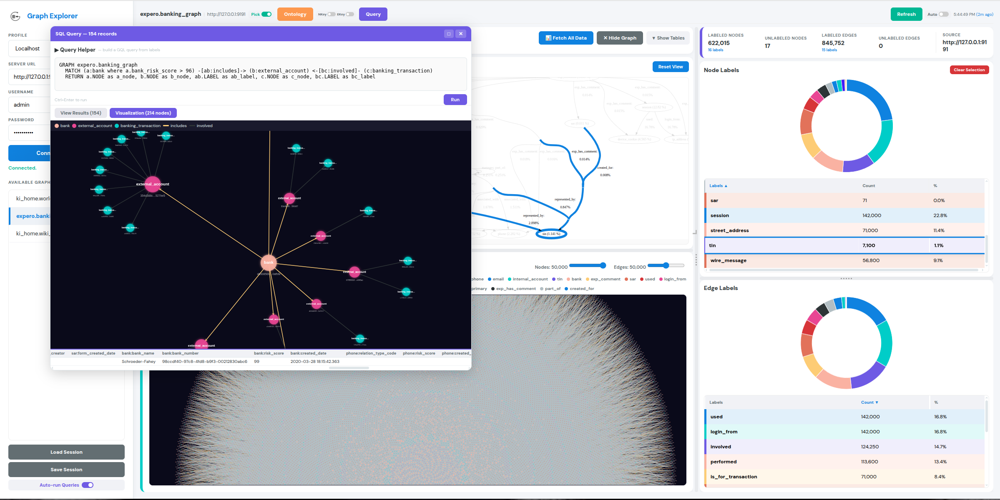
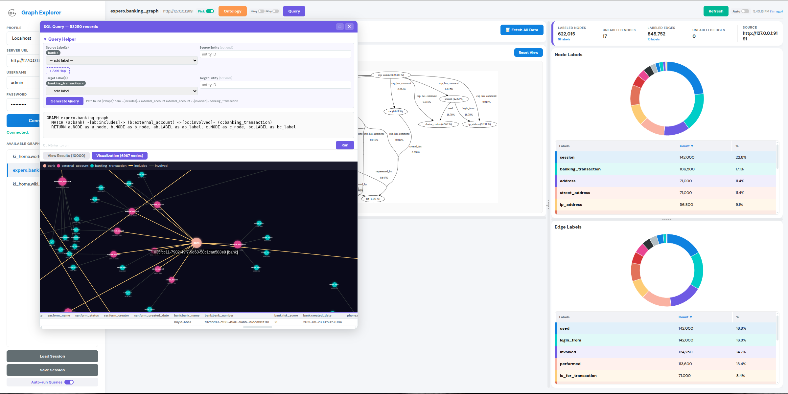

# Kinetica Graph Explorer

A zero-install, browser-based tool for exploring graph data structures in a [Kinetica](https://www.kinetica.com/) GPU database. Connect to any Kinetica instance, browse graphs, inspect label distributions, visualize ontology structures, run GQL queries, and explore query results as interactive path visualizations — all from a single HTML file.

## Quick Start

1. Open `KineticaGraphExplorer.html` in any modern browser.
2. Enter your Kinetica server URL, username, and password in the sidebar.
3. Click **Connect** — available graphs appear in the sidebar list.
4. Select a graph to explore.

No build step, no dependencies to install, no server to run.

## Screenshots


*Full explorer view: ontology structure, GQL query path visualization, force-graph canvas, and label distribution charts.*


*Ontology picking mode: clicking nodes/edges highlights matching labels across views.*

## Features

### Graph Overview
- **Label Distribution** — Interactive doughnut charts and sortable tables for node and edge labels, with counts and percentages. Click column headers to sort by label name (alphabetical) or count (default).
- **Summary Cards** — At-a-glance counts of labeled/unlabeled nodes and edges, with number of distinct labels shown.

### Ontology Visualization
- Click **Ontology** to render the graph's structural schema as a Graphviz DOT diagram.
- **NKey / EKey** toggles (default OFF) — control whether the ontology shows actual label names (`mentions`, `document`) or schema-grouped types (`RelationType`, `EntityType`). Re-click Ontology after toggling.
- Pan, zoom, and click on nodes/edges in the ontology to highlight matching labels in the charts.

### Graph Table Data
- **Fetch All Data** loads the graph's backing edge and node tables. Supports both NAME-based and ID-based column schemas.
- **Visualize** renders a force-directed graph (for non-geospatial graphs) with colors consistent with the label charts.
- Click a node in the visualization to **copy its entity ID** to clipboard (for use in Query Helper or queries).
- Label selection in the charts filters the visualization to matching subgraphs.

### SQL / GQL Query
- Click **Query** to open a floating, draggable, resizable SQL editor panel with maximize/restore button. Each click opens a **new independent panel** — multiple queries can be open simultaneously.
- **Query Helper** (collapsible, opens expanded by default, above the editor) — generates GQL queries from form inputs:
  - Select **Source Label(s)** (multi-select with tags), optional **Source Entity**
  - **"+ Add Hop"** to add intermediate waypoints, each with: hop index | **Node Label(s)** (multi-select tags) | **Edge Label** (dropdown)
  - Select **Target Label(s)** (multi-select with tags), optional **Target Entity**
  - Multiple labels use OR logic (e.g., `street_address` + `email` → `(a:street_address|email)`)
  - Click **Generate Query** — finds the shortest path between labels using the ontology graph (BFS through waypoints) and generates a direction-aware GQL MATCH pattern with proper `->` and `<-` arrows. Labels with spaces are auto-quoted. Helper auto-collapses after generation to show the query and visualization
  - If ontology is not loaded, falls back to a generic untyped pattern
  - Entity IDs can be pasted from click-to-copy on any graph visualization node
- Write or edit any SQL or GQL `GRAPH ... MATCH ... RETURN` query and press **Ctrl+Enter** (or click **Run**).
- After a successful query with hop data, the **Visualization** tab activates automatically. Two toggle buttons appear below the editor:
  - **View Results** — Expands a scrollable data table showing the RETURN statement columns.
  - **Visualization** — Expands an interactive force-directed path visualization with label-consistent colors, legend, directed arrows, and animated particles. Cleared automatically when a query returns no results. The graph responsively scales and re-centers on panel resize.
  - **Node Detail Lookup** — Click any node in the visualization to copy its ID and fetch its full record from the original node source table (e.g., `expero.vertexes`, not the internal graph table). The record is displayed as a horizontal table strip below the graph with all columns at natural width. Shows a brief "Copied" tooltip on the node. The visualization stays stable — no re-centering on click.

### Session Save / Load
Session controls are in the **Sidebar** (lower left, visible when connected):
- **Load Session** — Restore from a JSON file. Uses the active server connection (warns if session was saved from a different server). Warns if the graph is not found. Re-fetches table data and visualization if they were active.
- **Save Session** — Download current state as JSON (connection, graph, labels, ontology, data/viz state, queries including Query Helper selections). Confirms with filename on save.
- **Auto-run Queries** toggle (on by default) — when on, restored queries execute automatically on session load.

### Cross-View Picking
- Toggle **Pick** mode to enable bidirectional highlighting: clicking ontology elements highlights the label chart, and hovering chart rows highlights ontology nodes/edges.

### UI Controls
- **Auto-refresh** — Polling toggle (5s–5m intervals) for live label count monitoring.
- **Resizable split panes** — Drag dividers or the corner handle to resize panels.
- **Floating query panels** — Multiple independent panels, each draggable and resizable with SQL editor, results table, and graph visualization.
- **Tooltips** — All buttons and toggles have hover tooltips describing their function.

## Architecture

The application is a single HTML file containing inline CSS and JSX (transpiled in-browser by Babel). All library dependencies are loaded via CDN:

| Library | Purpose |
|---|---|
| React 18 | UI component framework |
| D3 v7 | SVG manipulation, zoom/pan for ontology viewer |
| Chart.js | Doughnut charts for label distribution |
| @hpcc-js/wasm (Graphviz) | DOT→SVG layout for ontology rendering |
| force-graph | Canvas-based force-directed graph visualization |

### Component Overview

| Component | Role |
|---|---|
| `App` | Root state management (graphs, credentials, labels, ontology, queries) |
| `Sidebar` | Server connection, profile switching, graph list, session Load/Save, Auto-run toggle |
| `DashboardHeader` | Single-line: graph info, Pick, Ontology, NKey/EKey, Query (left) — Refresh, Auto, timestamp (right) |
| `LabelChart` | Doughnut chart + interactive label table |
| `OntologyViewer` | Graphviz WASM rendering with D3 zoom/pan |
| `CanvasGraph` | Force-directed visualization of graph table data |
| `QueryPanel` | Self-contained SQL editor + results table + path visualization (multiple instances) |
| `SplitPane` | Resizable split layout (horizontal or vertical) |

### Kinetica API Endpoints

| Endpoint | Usage |
|---|---|
| `POST /show/graph` | List graphs or get label details for a specific graph |
| `POST /modify/graph` | Retrieve graph ontology in DOT format |
| `POST /get/records` | Fetch backing table rows for data preview and visualization |
| `POST /execute/sql` | Run SQL and GQL queries |

### Response Parsing

Kinetica REST responses are **double-wrapped**: the top-level JSON contains a `data_str` field which is itself a JSON string. For graph queries (`GRAPH ... MATCH ... RETURN ...`), the unwrapped response contains two distinct data sources:
- **`json_encoded_response`** — The RETURN statement columns (e.g., `bank`, `wire`, `transaction`). Displayed by the "View Results" button.
- **`info.gql_result`** — The hop-based path structure (`NODE1_HOP_1`, `EDGE_LABELS_HOP_1`, etc.). Used by the "Visualization" button for force-graph rendering.

Both are column-oriented JSON objects with `column_headers`, `column_datatypes`, and `column_1`..`column_N` arrays.

## Tests

The test suite validates response parsing, graph structure invariants, and live server connectivity using the `expero.banking_graph` banking fraud demo dataset.

### Running Tests

```bash
# All tests — requires a Kinetica server at http://127.0.0.1:9191
python3 tests/test_banking_query.py

# Offline only — runs against saved fixture files, no server needed
python3 tests/test_banking_query.py --offline
```

### Test Structure

```
tests/
  test_banking_query.py                # Test script (unittest, 30 tests)
  banking_query_response.json          # Fixture: /execute/sql GQL response
  banking_show_graph_response.json     # Fixture: /show/graph response
  expero_banking_graph_session.json    # Fixture: saved session with queries
  session_schema.json                  # JSON Schema for session validation
```

### Test Cases

**`TestFixtureParsing`** (10 tests, always run):

| Test | What it verifies |
|---|---|
| `test_data_str_unwrap` | `data_str` parses into a dict with `info` and `response_schema_str` |
| `test_record_count` | `info.count` equals 65 |
| `test_gql_result_structure` | `gql_result` has `column_headers`, `column_datatypes`, and matching `column_N` arrays |
| `test_hop_detection` | Exactly 2 hops detected from column headers |
| `test_hop1_columns_present` | All 8 expected HOP_1 columns exist |
| `test_node_labels_in_results` | Node labels are `{bank, wire_message, banking_transaction}` |
| `test_edge_labels_in_results` | Edge labels are `{performed, is_for_transaction}` |
| `test_source_node_consistent` | `NODE1_HOP_1` is the same UUID across all 65 rows |
| `test_path_continuity` | `NODE2_HOP_1 == NODE1_HOP_2` for every row |
| `test_show_graph_fixture` | `show/graph` fixture contains valid `info` field |

**`TestSessionFixture`** (13 tests, always run):

| Test | What it verifies |
|---|---|
| `test_session_version` | Session file has version 1 |
| `test_session_has_required_keys` | All required top-level keys present |
| `test_session_savedAt_is_iso8601` | Timestamp is valid ISO 8601 |
| `test_session_connection` | Has URL/user, no password |
| `test_session_graph_name` | Graph name matches `expero.banking_graph` |
| `test_session_graph_labels` | Label selections are valid arrays |
| `test_session_ontology_dot` | DOT string contains `digraph` and `->` |
| `test_session_data_fetched_flag` | `dataFetched` is boolean |
| `test_session_show_force_graph_flag` | `showForceGraph` is boolean |
| `test_session_queries_structure` | Queries have `sql` and valid `activeTab` |
| `test_session_queries_are_valid_gql` | Queries contain GRAPH/MATCH keywords |
| `test_session_queries_reference_correct_graph` | Queries reference the session's graph |
| `test_session_schema_validation` | Session conforms to `session_schema.json` |

**`TestLiveServer`** (3 tests, skipped if server unavailable):

| Test | What it verifies |
|---|---|
| `test_execute_sql_query` | Live query returns 65 records |
| `test_show_graph` | Live `show/graph` returns `labeljson` with node/edge labels |
| `test_gql_result_matches_fixture` | Live column headers/datatypes match saved fixture |

**`TestSessionLiveRestore`** (4 tests, skipped if server unavailable):

| Test | What it verifies |
|---|---|
| `test_session_connection_reachable` | Session's server URL is reachable |
| `test_session_graph_exists` | Session's graph exists and returns label data |
| `test_session_queries_execute` | Each session query returns results with hop columns |
| `test_session_selected_labels_valid` | Selected labels exist in the graph's label set |

### Reference Data

- **Server**: `http://127.0.0.1:9191` (user: `admin`, password: `***REMOVED***`)
- **Graph**: `expero.banking_graph`
- **Query**: 2-hop GQL traversal — `bank` → `wire_message` → `banking_transaction`
- **Expected**: 65 records, 3 node labels, 2 edge labels, path continuity across hops

## Browser Compatibility

Tested on Chrome, Firefox, and Edge. Requires ES2017+ support (async/await, `fetch`).
